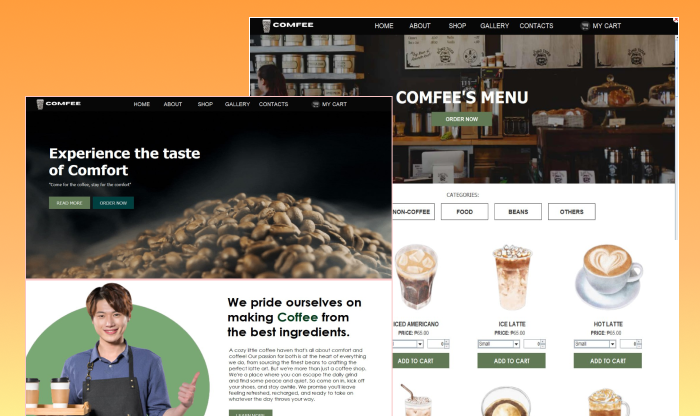

# Comfee - E-commerce Coffee Shop

Comfee short for "Comfort" and "Coffee". A static e-commerce application for managing Comfee, a coffee shop. Developed using Java Swing, this app allows customers to browse the coffee menu, gallery, view product items, and learn about the coffee shop. It features an easy-to-use interface for managing products and shop details.

## Features

- **User Login and Register**
- **Home, About, Menu, Gallery, Contact Page**

## Technologies I Used

**Frontend:**  Java Swing (for the user interface)

**Backend** Static data (since it's a simple app, no backend database is used)

**Language:** Java

## Screenshots

## License

This project is licensed under the [MIT](https://choosealicense.com/licenses/mit/) License - see the LICENSE file for details.
